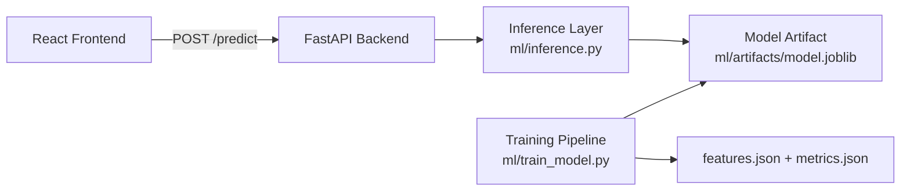
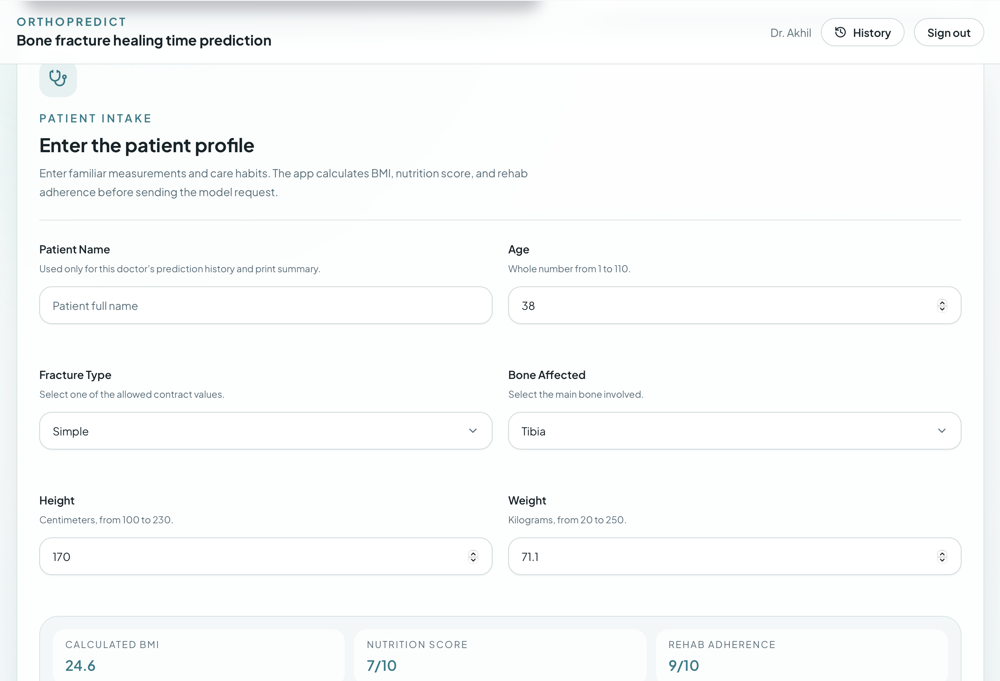
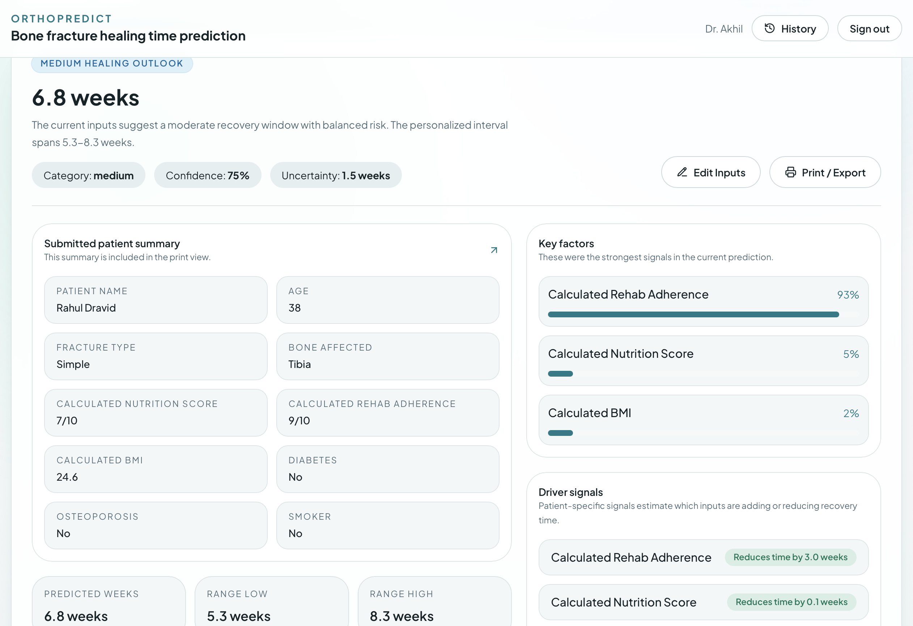
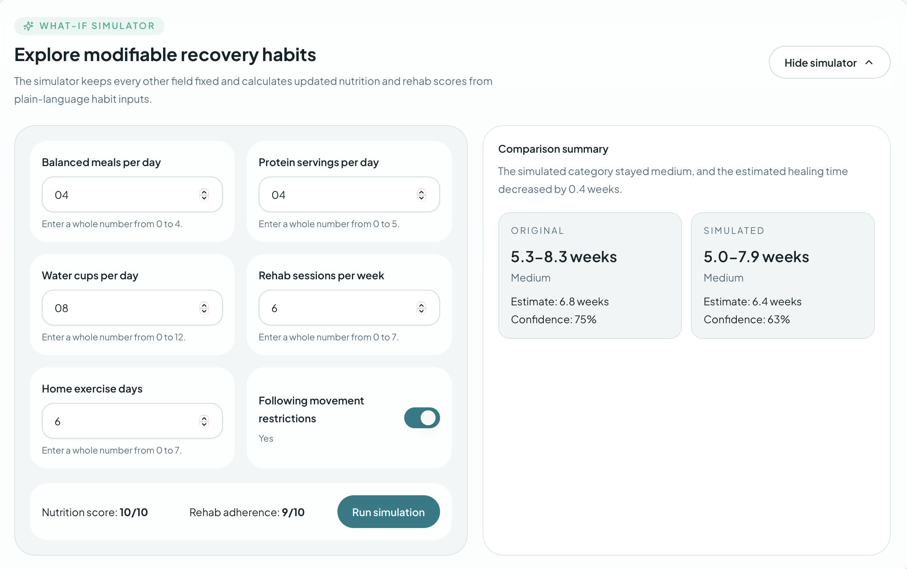

# OrthoPredict - Bone Fracture Healing Time Prediction

End-to-end ML application that predicts fracture healing duration (weeks) from structured clinical inputs, with interpretable outputs and a production-style web interface.

> Portfolio project: ML pipeline + FastAPI backend + React frontend with schema-aligned inference.

## Quick View

- Goal: estimate personalized fracture healing time.
- Input: 9 clinical features (age, fracture type, bone, BMI, nutrition, rehab adherence, diabetes, osteoporosis, smoker).
- Output: predicted weeks, confidence, uncertainty range, category (`short`, `medium`, `long`), probabilities, top drivers, rehab tips.
- Tech: Python, scikit-learn, FastAPI, React + TypeScript.
- Engineering focus: reproducibility, contract-first design, explainability, practical UX.

## Architecture



## Project Screenshots

### Landing Page


### Prediction Form



### Prediction Result



### What-If Simulator



## Key Features

- Synthetic clinical dataset generation (3,000 samples).
- Schema-preserving feature pipeline aligned with `docs/schema.json`.
- Preprocessing with `MinMaxScaler`, `OrdinalEncoder`, and `OneHotEncoder`.
- Model comparison using Linear Regression (baseline) and RandomForestRegressor (primary).
- Outputs beyond point estimate: uncertainty interval, category probabilities, driver signals, and rehab tips.
- Frontend what-if simulation for `nutrition_score` and `rehab_adherence`.

## Tech Stack

- ML: Python, pandas, scikit-learn, joblib
- Backend: FastAPI, Uvicorn, Pydantic
- Frontend: React, TypeScript, Vite, Tailwind, shadcn/ui, zod, react-hook-form, axios, chart.js, framer-motion

## Repository Structure

```text
bone-fracture/
|- backend/
|- docs/
|  |- schema.json
|  |- screenshots/
|- frontend/
|- ml/
|  |- artifacts/
|  |- inference.py
|  |- train_model.py
|- data/
|- requirements.txt
|- README.md
```

## Local Setup

### 1) Backend

```bash
python3 -m venv .venv
source .venv/bin/activate
pip install -r requirements.txt
uvicorn backend.main:app --reload
```

Backend: `http://127.0.0.1:8000`

### 2) Frontend

```bash
cd frontend
cp .env.example .env
npm install
npm run dev
```

Frontend: `http://127.0.0.1:5173`

`frontend/.env`:

```bash
VITE_API_BASE_URL=http://127.0.0.1:8000
```

## Train the Model

```bash
python3 ml/train_model.py
```

Artifacts generated:

- `data/synthetic_bone_fracture_healing.csv`
- `ml/artifacts/model.joblib`
- `ml/artifacts/features.json`
- `ml/artifacts/metrics.json`

## API Example

Endpoint: `POST /predict`

Request:

```json
{
  "age": 38,
  "fracture_type": "simple",
  "bone_affected": "tibia",
  "nutrition_score": 7,
  "rehab_adherence": 8,
  "bmi": 24.6,
  "diabetes": false,
  "osteoporosis": false,
  "smoker": false
}
```

Python usage:

```python
from ml.inference import predict_from_payload

payload = {
    "age": 38,
    "fracture_type": "simple",
    "bone_affected": "tibia",
    "nutrition_score": 7,
    "rehab_adherence": 8,
    "bmi": 24.6,
    "diabetes": False,
    "osteoporosis": False,
    "smoker": False,
}

print(predict_from_payload(payload))
```

## Note
- This project is for educational and portfolio use and decision-support tool. Not a clinical diagnostic tool.

## Author

**Akhil Udumala**

GitHub: [Akhil-Udumala](https://github.com/Akhil-Udumala)
